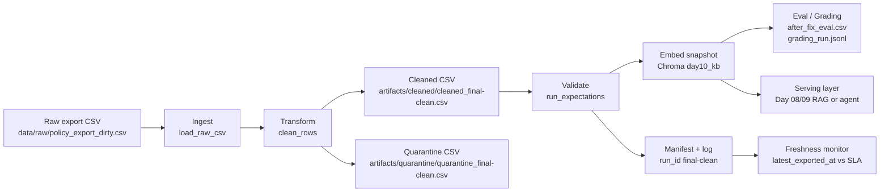

# Kiến trúc pipeline — Lab Day 10

**Nhóm:** Cá nhân - Lê Dương Hiếu (2A202600635)  
**Cập nhật:** 2026-06-10  
**Run cuối:** `final-clean`

---

## 1. Sơ đồ luồng

Điểm đo chính: `run_id` được ghi ngay khi ingest; `raw_records`, `cleaned_records`, `quarantine_records` được ghi sau transform; freshness đo trên `latest_exported_at` trong manifest sau publish. Record bị loại không bị drop âm thầm mà đi vào quarantine kèm `reason`.

---

## 2. Ranh giới trách nhiệm

| Thành phần | Input | Output | Owner |
|------------|-------|--------|------------|
| Ingest | `data/raw/policy_export_dirty.csv` | list row raw, `raw_records=247` | Lê Dương Hiếu |
| Transform | raw rows | cleaned rows + quarantine reasons | Lê Dương Hiếu |
| Quality | cleaned rows | expectation result, halt/warn decision | Lê Dương Hiếu |
| Embed | cleaned CSV | Chroma collection `day10_kb`, upsert 37 chunk | Lê Dương Hiếu |
| Monitor | manifest JSON | freshness PASS/WARN/FAIL | Lê Dương Hiếu |
| Eval | Chroma collection + question JSON | `after_fix_eval.csv`, `grading_run.jsonl` | Lê Dương Hiếu |

---

## 3. Idempotency & rerun

Pipeline dùng `chunk_id` ổn định theo `doc_id`, nội dung đã clean và sequence. Embed dùng `col.upsert(ids=ids, ...)`, nên rerun cùng input không tạo duplicate id. Trước khi upsert, pipeline đọc id cũ trong collection và prune id không còn trong cleaned snapshot; run cuối ghi `embed_prune_removed=2` sau khi restore từ `inject-bad` về `final-clean`. Nhờ vậy vector chứa chunk stale 14 ngày sau Sprint 3 không còn tồn tại trong publish sạch.

---

## 4. Liên hệ Day 09

Collection `day10_kb` là corpus sạch cho RAG/agent kiểu Day 08/09. Day 09 tập trung orchestration và agent behavior; Day 10 đảm bảo tài liệu mà agent đọc đã qua allowlist, versioning, expectation và freshness. Khi tích hợp, agent chỉ cần trỏ retriever sang collection `day10_kb` hoặc dùng cùng cleaned CSV làm nguồn rebuild collection riêng.

---

## 5. Rủi ro đã biết

- Freshness hiện `FAIL` vì dữ liệu mẫu mới nhất là `2026-04-11T00:00:00`, trong khi run ngày `2026-06-10`, vượt SLA 24h.
- Console Windows đang có noise từ dependency TensorFlow/NumPy khi import `sentence_transformers`; command vẫn exit 0 và artifact vẫn được ghi.
- Hybrid rerank trong eval/grading chỉ là rerank ứng viên từ Chroma, chưa thay thế một retriever production đầy đủ có BM25 index riêng.
- Nếu thêm nguồn canonical mới, phải đồng bộ `ALLOWED_DOC_IDS`, `contracts/data_contract.yaml`, expectation `required_canonical_doc_ids_present` và bộ câu hỏi eval.
